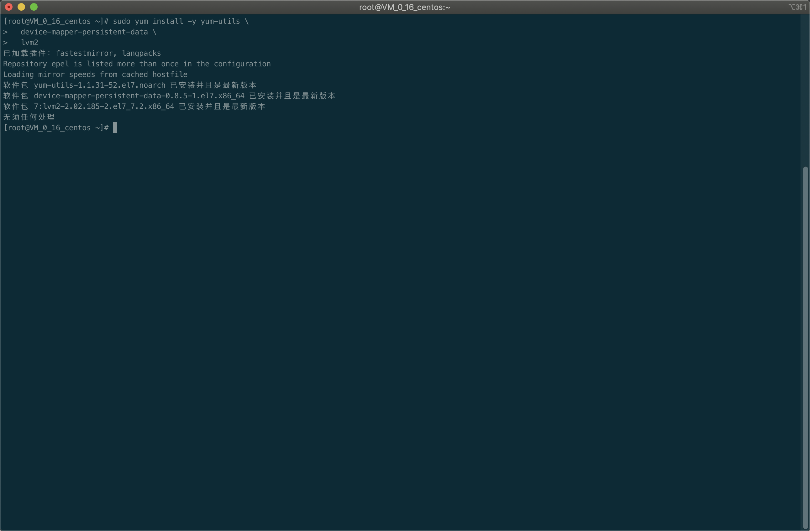
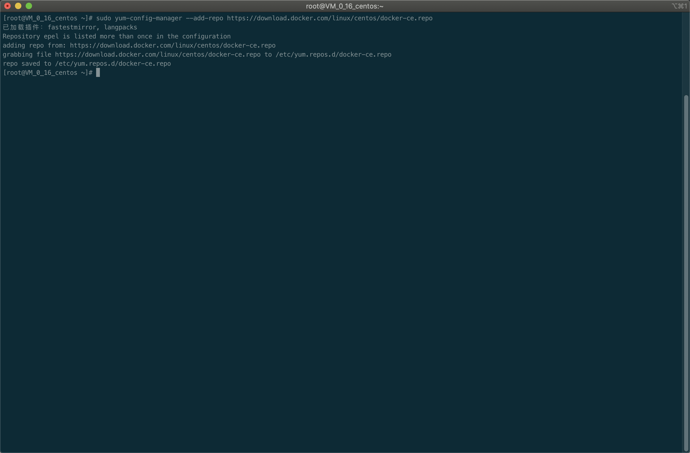
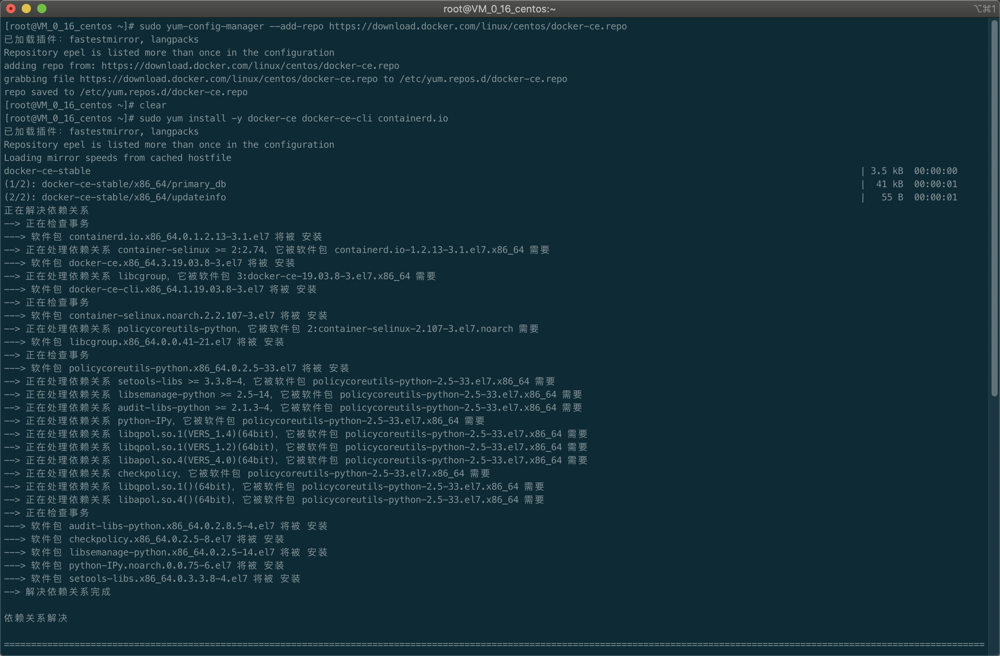

# Docker

Docker 是一个开源的应用容器引擎，基于 Go 语言 并遵从 Apache2.0 协议开源。

Docker 可以让开发者打包他们的应用以及依赖包到一个轻量级、可移植的容器中，然后发布到任何流行的 Linux 机器上，也可以实现虚拟化。

容器是完全使用沙箱机制，相互之间不会有任何接口（类似 iPhone 的 app）,更重要的是容器性能开销极低。

## Docker 的应用场景

- Web 应用的自动化打包和发布。

- 自动化测试和持续集成、发布。

- 在服务型环境中部署和调整数据库或其他的后台应用。

- 从头编译或者扩展现有的 OpenShift 或 Cloud Foundry 平台来搭建自己的 PaaS 环境。

## Docker 架构

Docker 包括三个基本概念:

- **镜像** (Image): Docker 镜像, 就相当于是一个 root 文件系统. 比如官方镜像 ubuntu:16.04 就包含了一套 Ubuntu16.04 最小系统的 root 文件系统

- **容器** (Container): 镜像和容器的关系, 就像面向对象程序设计中的类和实例一样, 镜像是静态的定义, 容器是镜像运行时的实体. 容器可以被创建、启动、停止、删除、暂停等

- **仓库** (Repository): 仓库可以看做一个代码控制中心, 用来保存镜像

Docker 使用客户端-服务器 (C/S) 架构模式，使用远程 API 来管理和创建 Docker 容器。

Docker 容器通过 Docker 镜像来创建。

容器与镜像的关系类似于面向对象编程中的对象与类。

## CentOS7 安装 Docker

### 卸载旧版本

旧的 Docker 版本称为 docker 或 docker-engine 如果已经安装过这些程序, 需要先卸载以及相关依赖

```shell
sudo yum remove docker \
                docker-client \
                docker-client-latest \
                docker-common \
                docker-latest \
                docker-latest-logrotate \
                docker-logrotate \
                docker-engine
```


### 安装 epel 更新源

```shell
yum install -y vim wget epel-release
```


### 使用 Docker 仓库进行安装

在新主机上首次安装 Docker Engine-Community 之前, 需要设置 Docker 仓库. 之后可以从仓库安装和更新 Docker

#### 设置仓库

安装所需的软件包, yum-utils 提供了 yum-config-manager, 并且 device mapper 存储驱动程序需要 device-mapper-persistent-data 和 lvm2

```shell
sudo yum install -y yum-ytils \
  device-mapper-persistent-data \
  lvm2
```



鉴于国内网络问题, 执行以下命令添加 yum 软件源

```shell
sudo yum-config-manager \
  --add-repo \
  https://download.docker.com/linux/centos/docker-ce.repo
```



#### 安装 Docker Engine-Community

安装最新版本的 Docker Engine-Community 和 containerd

```shell
sudo yum install -y docker-ce docker-ce-cli containerd.io
```




#### 配置 163 镜像加速

增加配置

```shell
sudo tee /etc/docker/daemon.json <<-'EOF'
{  "registry-mirrors": ["http://hub-mirror.c.163.com"]
}
EOF
```

重启 docker

```shell
sudo systemctl restart docker
```

安装 docker 命令补全工具

```shell
yum install -y bash-completion
```

设置 docker 开机启动

```shell
systemctl enable docker
```


## docker 常用命令

> [更多 Dokcer 命令](https://www.runoob.com/docker/docker-command-manual.html)

### docker run

创建一个新的容器并运行一个命令

语法:

> docker run [OPTIONS] IMAGE [COMMAND][arg...]

OPTIONS 说明：

-a stdin: 指定标准输入输出内容类型，可选 STDIN/STDOUT/STDERR 三项；

-d: 后台运行容器，并返回容器 ID；

-i: 以交互模式运行容器，通常与 -t 同时使用；

-P: 随机端口映射，容器内部端口随机映射到主机的高端口

-p: 指定端口映射，格式为：主机(宿主)端口:容器端口

-t: 为容器重新分配一个伪输入终端，通常与 -i 同时使用；

--name="nginx-lb": 为容器指定一个名称；

--dns 8.8.8.8: 指定容器使用的 DNS 服务器，默认和宿主一致；

--dns-search example.com: 指定容器 DNS 搜索域名，默认和宿主一致；

-h "mars": 指定容器的 hostname；

-e username="ritchie": 设置环境变量；

--env-file=[]: 从指定文件读入环境变量；

--cpuset="0-2" or --cpuset="0,1,2": 绑定容器到指定 CPU 运行；

-m :设置容器使用内存最大值；

--net="bridge": 指定容器的网络连接类型，支持 bridge/host/none/container: 四种类型；

--link=[]: 添加链接到另一个容器；

--expose=[]: 开放一个端口或一组端口；

--volume , -v: 绑定一个卷

### docker start/stop/restart 命令

**docker start** : 启动一个或多个已经被停止的容器

**docker stop** : 停止一个运行中的容器

**docker restart** : 重启容器

语法

> docker start [OPTIONS] CONTAINER [CONTAINER...]

> docker stop [OPTIONS] CONTAINER [CONTAINER...]

> docker restart [OPTIONS] CONTAINER [CONTAINER...]

实例

启动已被停止的容器 jenkins

```shell
docker start jenkins
```

停止运行中的容器 jenkins

```shell
docker stop jenkins
```

重启容器 jenkins

```shell
docker restart jenkins
```

### Docker kill 命令

杀掉一个运行中的容器。

语法

> docker kill [OPTIONS] CONTAINER [CONTAINER...]

OPTIONS 说明：

-s :向容器发送一个信号

实例

杀掉运行中的容器 jenkins

```shell
docker kill -s KILL jenkins
```

### Docker rm 命令

删除一个或多个容器。

语法:

> docker rm [OPTIONS] CONTAINER [CONTAINER...]

OPTIONS 说明：

-f :通过 SIGKILL 信号强制删除一个运行中的容器。

-l :移除容器间的网络连接，而非容器本身。

-v :删除与容器关联的卷。

实例:

强制删除容器 db01、db02：

```shell
docker rm -f db01 db02
```

移除容器 nginx01 对容器 db01 的连接，连接名 db：

```shell
docker rm -l db
```

删除容器 nginx01, 并删除容器挂载的数据卷：

```shell
docker rm -v nginx01
```

删除所有已经停止的容器：

```shell
docker rm \$(docker ps -a -q)
```

**docker pause** :暂停容器中所有的进程。

**docker unpause** :恢复容器中所有的进程。

语法

> docker pause [OPTIONS] CONTAINER [CONTAINER...]

> docker unpause [OPTIONS] CONTAINER [CONTAINER...]

实例

暂停数据库容器 db01 提供服务。

```shell
docker pause db01
```

恢复数据库容器 db01 提供服务。

```shell
docker unpause db01
```

### Docker ps 命令

列出容器

语法

> docker ps [OPTIONS]

OPTIONS 说明：

-a :显示所有的容器，包括未运行的。

-f :根据条件过滤显示的内容。

--format :指定返回值的模板文件。

-l :显示最近创建的容器。

-n :列出最近创建的 n 个容器。

--no-trunc :不截断输出。

-q :静默模式，只显示容器编号。

-s :显示总的文件大小。

实例

列出所有在运行的容器信息。

```shell
docker ps

# 输入
CONTAINER ID IMAGE COMMAND ... PORTS NAMES
09b93464c2f7 nginx:latest "nginx -g 'daemon off" ... 80/tcp, 443/tcp myrunoob
```

输出详情介绍：

CONTAINER ID: 容器 ID。

IMAGE: 使用的镜像。

COMMAND: 启动容器时运行的命令。

CREATED: 容器的创建时间。

STATUS: 容器状态。

状态有 7 种：

    created（已创建）
    restarting（重启中）
    running（运行中）
    removing（迁移中）
    paused（暂停）
    exited（停止）
    dead（死亡）
    PORTS: 容器的端口信息和使用的连接类型（tcp\udp）。

NAMES: 自动分配的容器名称。

### Docker logs 命令

获取容器的日志

语法

> docker logs [OPTIONS] CONTAINER

OPTIONS 说明：

-f : 跟踪日志输出

--since :显示某个开始时间的所有日志

-t : 显示时间戳

--tail :仅列出最新 N 条容器日志

### Docker images 命令

列出本地镜像。

语法

> docker images [OPTIONS]REPOSITORY[:TAG]]

OPTIONS 说明：

-a :列出本地所有的镜像（含中间映像层，默认情况下，过滤掉中间映像层）；

--digests :显示镜像的摘要信息；

-f :显示满足条件的镜像；

--format :指定返回值的模板文件；

--no-trunc :显示完整的镜像信息；

-q :只显示镜像 ID。

### Docker commit 命令

从容器创建一个新的镜像。

语法

> docker commit [OPTIONS] CONTAINER [REPOSITORY[:TAG]]

OPTIONS 说明：

-a :提交的镜像作者；

-c :使用 Dockerfile 指令来创建镜像；

-m :提交时的说明文字；

-p :在 commit 时，将容器暂停。

### Docker cp 命令

用于容器与主机之间的数据拷贝。

语法

> docker cp [OPTIONS] CONTAINER:SRC_PATH DEST_PATH|-
> docker cp [OPTIONS] SRC_PATH|- CONTAINER:DEST_PATH

OPTIONS 说明：

-L :保持源目标中的链接

Docker rmi 命令

删除本地一个或多少镜像。

语法

> docker rmi [OPTIONS] IMAGE [IMAGE...]

OPTIONS 说明：

-f :强制删除；

--no-prune :不移除该镜像的过程镜像，默认移除；

Docker exec 命令

在运行的容器中执行命令

语法

> docker exec [OPTIONS] CONTAINER COMMAND [ARG...]

OPTIONS 说明：

-d :分离模式: 在后台运行

-i :即使没有附加也保持 STDIN 打开

-t :分配一个伪终端
