# Jenkins

Jenkins 是一个独立的开源软件项目，是基于 Java 开发的一种持续集成工具，用于监控持续重复的工作，旨在提供一个开放易用的软件平台，使软件的持续集成变成可能。前身是 Hudson 是一个可扩展的持续集成引擎。可用于自动化各种任务，如构建，测试和部署软件。Jenkins 可以通过本机系统包 Docker 安装，甚至可以通过安装 Java Runtime Environment 的任何机器独立运行。

> [Jenkins 中文文档](https://www.jenkins.io/zh/doc/)

## 安装 jenkins

> 本文主要主要通过 Docker 对 jenkins 进行安装. 其他安装方法可以参考 Jenkins 官方文档

打开 [Docker hub](https://hub.docker.com/) 搜索 jenkins (需要登录), 点击搜索结果


进入详情页后, 往下翻, 找到 `How to use image`

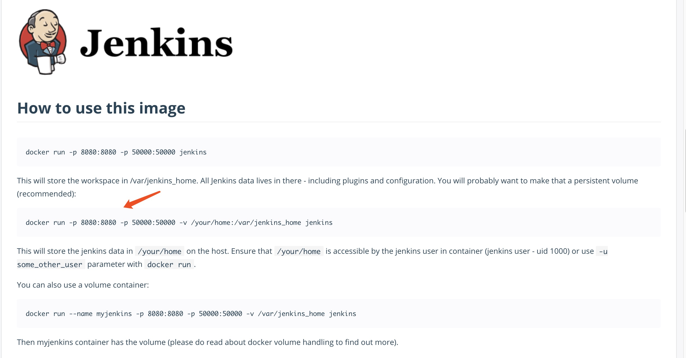

根据官方提供的命令安装 jenkins

> 此处我加上了一些额外参数

```shell
# docker run: 指定一个新的容器并运行一个命令
# --name: 指定容器名称
# -itd:
#     i: 打开STDIN，用于控制台交互
#     t: 分配tty设备，该可以支持终端登录，默认为false
#     d: 后台运行
# -p 11005:8080: 指定容器暴露的端口
# -p 50000:50000: 指定容器暴露的端口
# jenkins/jenkins:lts: 使用 jenkins/jenkins 的长期支持版本
docker run --name jenkins_ginger -itd -p 11005:8080 -p 50000:50000 jenkins/jenkins:lts
```

如图表示安装成功, 通过 `docker ps` 也可以查看到 jenkins 正在运行

```shell
docker ps
```

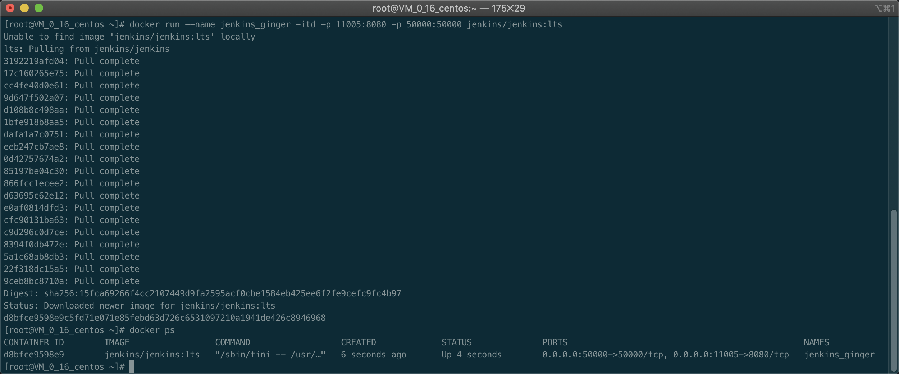

## 查看 jenkins 默认密码

通过 `docker logs -f jenkins_ginger` 可以查看到 jenkins 的日志, 从日志中, 可以获取到 jenkins 的默认密码

```shell
# -f: 跟踪日志输出
docker log -f jenkins_ginger
```


## 登录 jenkins

打开浏览器, 输入 `xx.xx.xx.xx:11005` 服务器公网 ip 地址加上刚刚运行时指定的 11005 端口, 就可以看到如下图所示登录页面, 输入上一步获取到的密码, 点击继续


点击安装推荐的插件

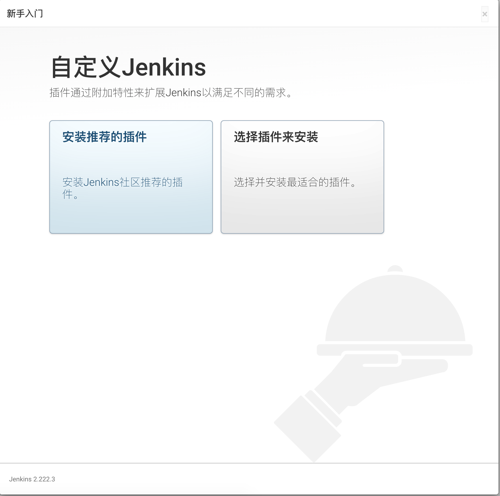

进入漫长的等待...


插件安装完成后, 会进入一个设置界面


输入账户密码, 点击继续

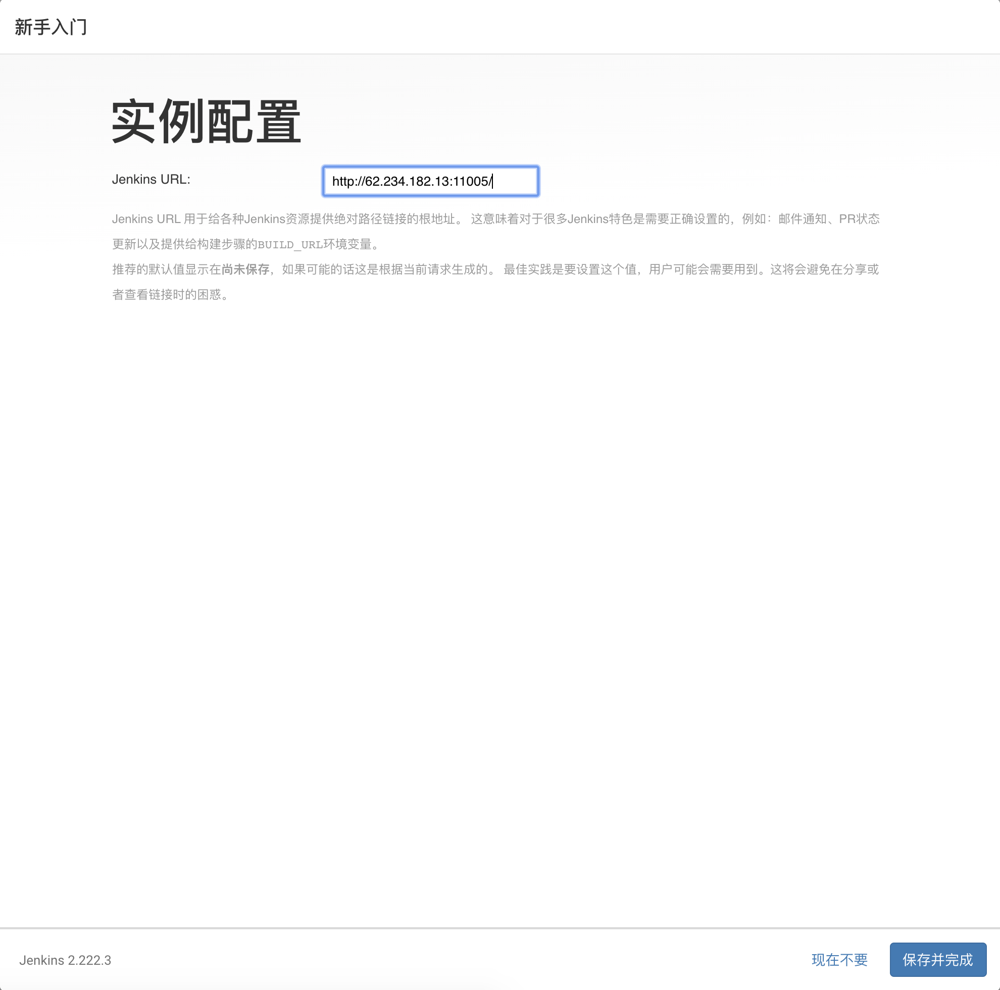

点击保存并完成


至此 Jenkins 就安装完成了

## 添加清华镜像源

jenkins 默认从国外镜像源下载镜像, 速度非常感人. 所以我们先更换源地址

点击 `Manage Jenkins` -> `Manage Plugins` -> `高级` -> `升级站点`

> 清华镜像源地址: https://mirrors.tuna.tsinghua.edu.cn/jenkins/updates/update-center.json

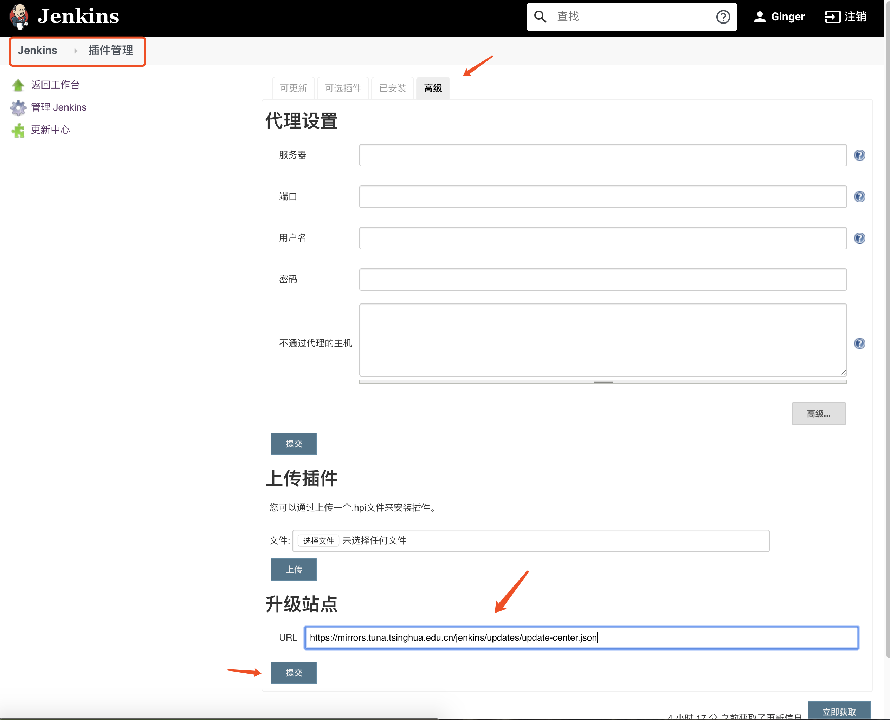

## 添加第一个构建任务

打开 jenkins 选择创建一个新任务


输入任务名称, 选择第一项 `构建一个自由风格的软件项目` 点击确定

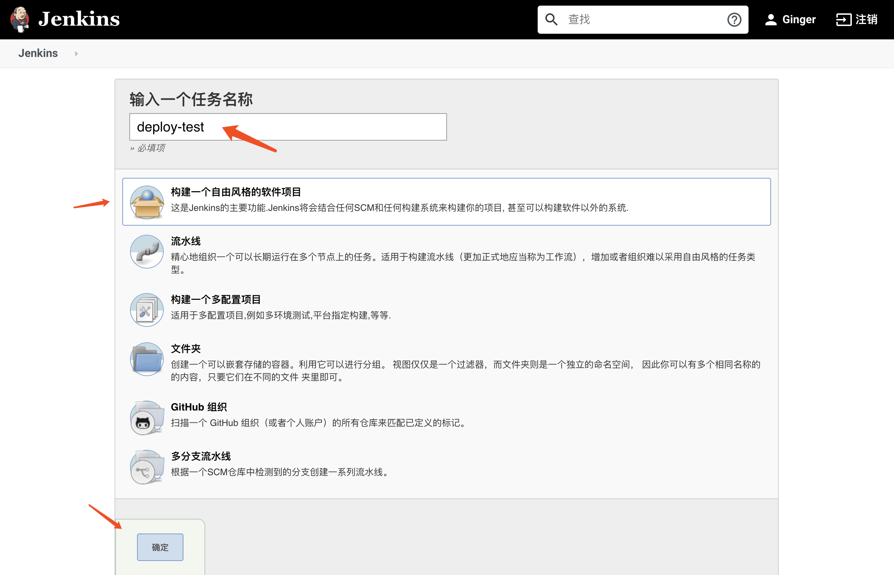

在 jenkins 首页 点击 **凭证** 添加凭证 选择 ssh

在本地机器上通过命令创建秘钥

```shell
ssh-keygen -t rsa -b 4096 -C 'XXX@gmail.com'
```

通过 cat 命令获取私钥, 放入私钥至全局凭证, 取一个容易辨识的名称

```shell
cat  .ssh/id_rsa
```


通过 cat 命令获取公钥, 配置到 gitlab 的部署秘钥项中

```shell
cat  .ssh/id_rsa.pub
```

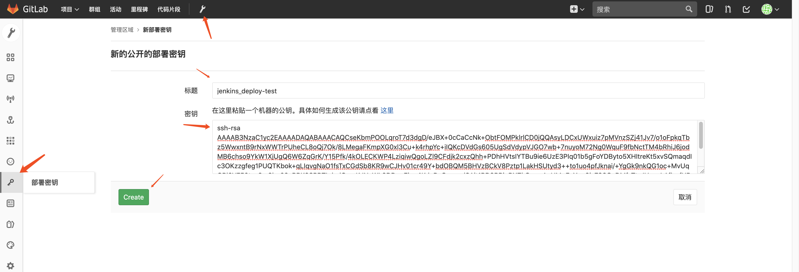

打开需要进行部署的 gitlab 项目仓库, 打开仓库设置, 版本库设置, `Deploy Keys`项

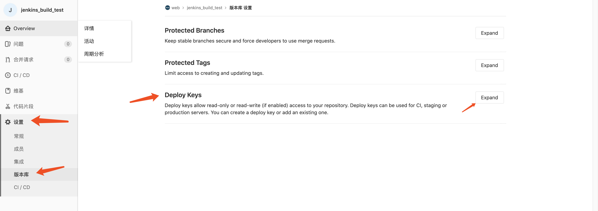

翻到下面, 找到之前配置的部署公钥, 点击 `Enable` 启用公钥

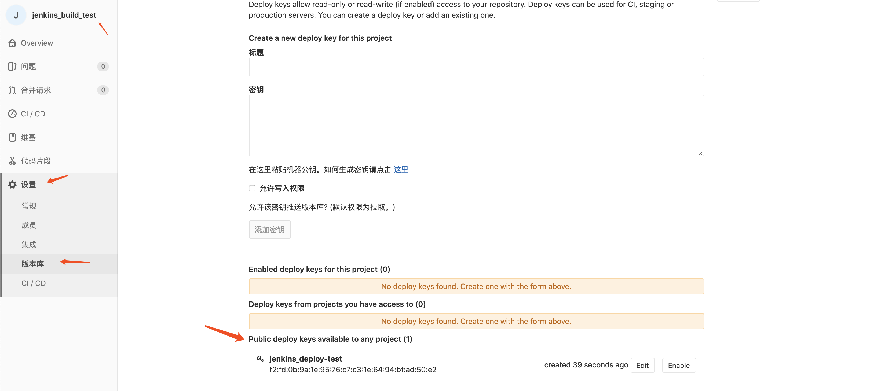

点击仓库名, 复制仓库 SSH 地址. 回到 jenkins 打开第一步创建的构建任务, 选择配置

配置源码管理:

    - 在源码管理菜单找到 `Git` 项
    - 输入复制的仓库地址
    - 选择第二步加入的凭证
    - 选择需要读取的分支

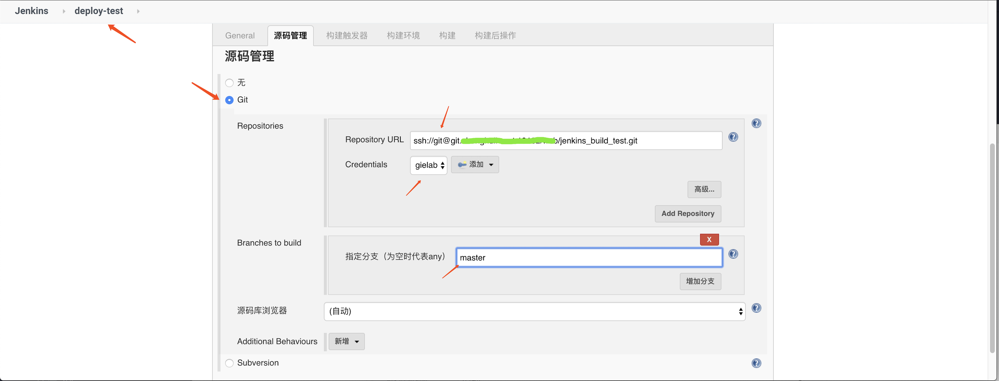

配置构建触发器:

    - 选择 `Build when a change is pushed to GitLab` 项
    - 点开 `高级`
    - 点击最下面的 `Generate`
    - 得到一个 url 与一个 token


打开 gitlab 仓库设置 -> 集成设置:

    - 配置链接为上一步从 jenkins 获取到的链接
    - 配置安全令牌为上一步从 jenkins 获取到的 token
    - 取消 ssl 选项
    - 点击增加 web 钩子

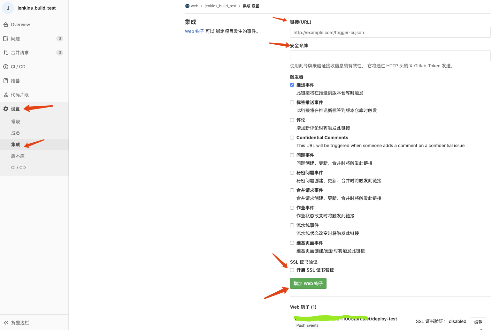

回到 jenkins -> 打开构建任务 -> 配置 -> 选择构建 -> 选择执行 shell -> 输入一个 shell 命令测试下

```shell
echo 'Hello World'
```

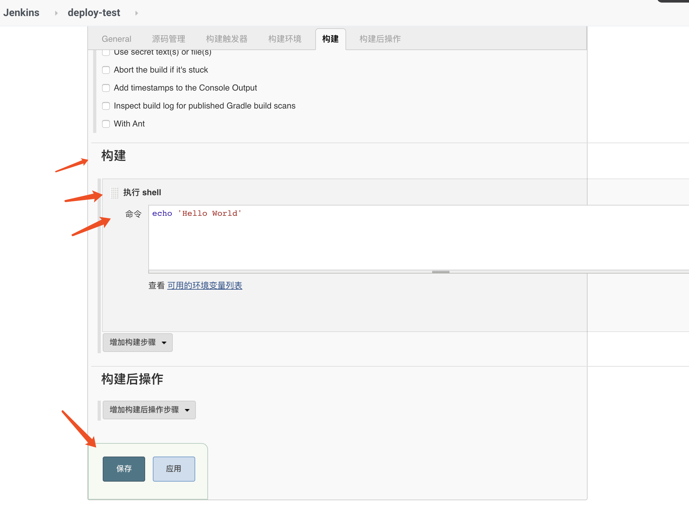

回到 gielab, 使用 `git clone xxxx` 克隆仓库到本地, 添加一个文件, 提交一个 `commit`.

就可以看到 jenkins 首页已经收到我们的任务, 并开始自动进行构建

## 常用插件列表：

### 权限相关

- 添加 Github 授权认证 [GitHub Authentication](https://plugins.jenkins.io/github-oauth)
- 权限相关：[PAM Authentication](https://plugins.jenkins.io/pam-auth), [Matrix Authorization Strategy](https://plugins.jenkins.io/matrix-auth), [Role-based Authorization Strategy](https://plugins.jenkins.io/role-strategy)

### Git 相关

- Git 相关：[Git plugin](https://github.com/jenkinsci/git-plugin), [SSH Slaves](https://plugins.jenkins.io/ssh-slaves), [GitHub](https://plugins.jenkins.io/github), [GitLab Plugin](https://wiki.jenkins-ci.org/display/JENKINS/GitLab+Plugin)

### 构建相关

- 添加构建的选择参数 Extended Choice Parameter plugin
- 参数化构建 Build With Parameters Plugin
- 定时周期执行任务, crontab Cron Column Plugin
- 添加 python 支持 Python Plugin
- 添加构建名字 Build Name Setter Plugin
- 构建超时 Build-timeout Plugin
- 构建环境变量注入 Build Environment
- 构建状态：Embeddable Build Status
- 构建名称设置：Build Name and Description Setter

### 通知相关

- 发邮件 Mailer
- 邮件模板 Email Extension Template
- 使用绿色代替默认的蓝色表示任务运行成功的状态 Green Balls
- 彩色输出日志 AnsiColor Plugin
- 硬盘使用情况 Disk Usage
- 变更查询 Job Configuration History

- 实时的执行任务的节点名称：built-on-column
