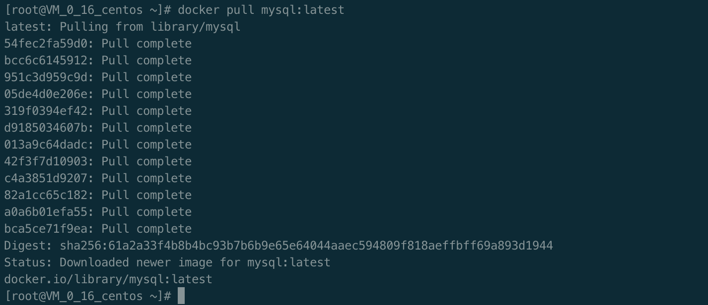
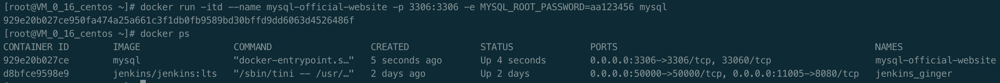
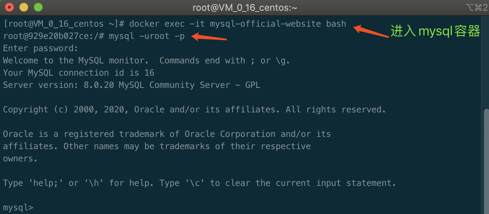
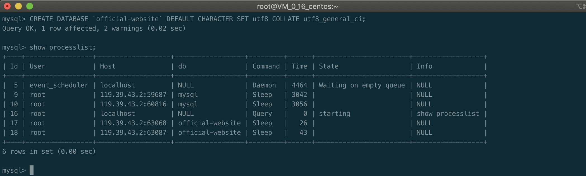
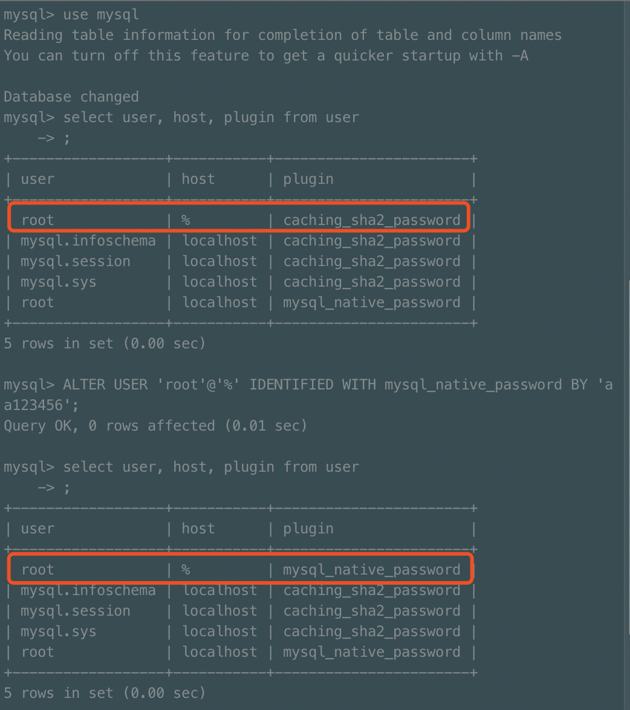

# MySql

MySQL 是一个关系型数据库，使用 SQL 语言进行增删改查操作，目前属于 Oracle 旗下的产品。

MySQL 数据库开源免费，能够跨平台，支持分布式，性能也不错，可以和 PHP、Java 等 Web 开发语言完美配合，非常适合中小型企业作为 Web 数据库（网站数据库）

## Docker 安装 MySql

进入 [docker hub](https://hub.docker.com/_/mysql) 可以看到 mysql 镜像

通过 `docker search` 的命令可以查看 mysql 的可用版本

```shell
docker search mysql
```


## 拉取 MySql 镜像

通过 `docker pull` 命令拉取官方的最新版本镜像

```shell
docker pull mysql:latest
```



## 查看本地镜像

通过 `docker images` 查看本地镜像, 通过 `TAG` 我们可以看到 mysql 最新版镜像已经安装成功

```shell
docker images
```


## 运行容器

安装完成后, 我们可以通过 `docker run` 命令来运行 mysql 容器

通过 `docker ps` 查看 mysql 容器是否在运行

```shell
# -p 3306:3306: 映射容器服务的3306端口到宿主机的3306端口, 让外部可以直接通过 宿主机ip:3306 访问到 MySql 服务
# MYSQL_ROOT_PASSWORD=123456：设置 MySQL 服务 root 用户的密码。
docker run -itd --name mysql-official-website -p 3306:3306 -e MYSQL_ROOT_PASSWORD=你的密码 mysql
docker ps
```



## 登录数据库

### 登录远程服务器

因为我的 mysql 安装在我的云服务器上, 所以需要先登录云服务器, 如果安装在本地可略过这一步

```shell
ssh root@xx.xx.xx.xx
```

### 进入 mysql 容器

我们可以通过 `docker exec` 命令, 进入我们在运行的 mysql 容器

通过 `mysql` 的命令进入 mysql 命令行

```shell
# -i:即使没有附加也保持STDIN 打开
# -t: 分配一个伪终端
# mysql-official-website: 你启动容器时候取的容器名字
docker exec -it mysql-official-website bash # 进入 mysql 容器

mysql -uroot -p # 进入 mysql 命令行 需要输入密码
```



## 创建数据库

通过上一步, 我们已经进入了 mysql 命令行

在 mysql 命令行, 我们可以通过 `CREATE DATABASE` 来创建数据库

通过 `show processlist;` 来查看所有库

```mysql
CREATE DATABASE `databasename` DEFAULT CHARACTER SET utf8 COLLATE utf8_general_ci;

show processlist;
```



## 一个 mysql 8 版本的 bug

```shell
# 报错信息
nodejs.ER_NOT_SUPPORTED_AUTH_MODEError: ER_NOT_SUPPORTED_AUTH_MODE: Client does not support authentication protocol requested by server; consider upgrading MySQL client
```

从 MySQL8.0 开始，默认的加密规则使用的是 caching_sha2_password

进入 mysql 命令行, 依次执行如下命令

```shell
# 查看当前 root 用户的加密规则
mysql> use mysql;
mysql> select user, host, plugin from user
```

```shell
# 修改加密规则
ALTER USER 'root'@'%' IDENTIFIED WITH mysql_native_password BY 'password';
```



## 常用 mysql 命令

    - 退出 mysql 命令行: exit
    - 清空 mysql 终端: system clear
